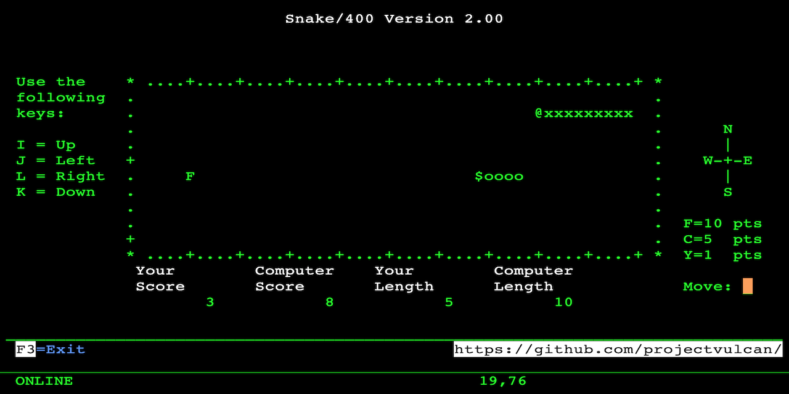

# Snake/400 An Interactive Snake Game for 5250 Emulator
Play against the computer in this 5250 emulation of the traditional Snake game written in RPG ILE for AS/400.

## Introduction
In 2003 as a 22 year old Software Engineer in Kuala Lumpur, I explored the method of overidding DSPF with DTAQ to receive user input. The idea was to build a data queue monitor and a file monitor with automated screen refresh on the 5250 emulation. And I did. But I was also inspired to write a game on the 5250. Snake/400 was the result of this.

10 years later in 2013 during a project in Bangkok, I updated the code to include a computer opponent, almost overnight.

There may be other implementation of Snake/400 but none is like mine. For starters, the screen auto refresh and the snake moves by itself without the user pressing any key. And secondly, you have a computer opponent.

## How to Compile
First, upload the source to your AS/400 using FTP or other similar means, then set the correct source type for each member:
1. GU007R RPGLE
2. GU007D DSPF
3. GU007C CLLE

The compile as follows:
1. Compile GU007D using option 14. This will create the display file.
2. Compile GU007C using option 14. This will create the CLLE program.
3. Compile GU007R using option 15. This will create the RPG module.
4. Issue command CRTPGM PGM(GU007R) with GU007R as the module and make sure the activiation group is caller. This will create the main program.

If you run into any difficulties with the source code, please verify that:
1. The source physical file ('PF') is at least 112 in length, for example, CRTSRCPF FILE(QRPGLESRC) RCDLEN(112).
2. The code page of the PF and your job is 37, for example, CHGJOB CCSID(37).
3. The FTP mode of transfer was set to ASCII during upload.

## Running the Program
Call the CLLE program, e.g. CALL GU007C. Do not call the RPG program directly.

Once inside the game, if you don't press any key, the screen will auto refresh itself and your computer opponent will move. You can control the direction of your snake using I (up), J (left), K (down), L (right) just like the good old days of computer games in the 1980s. The objective is to eat the alphabets before your opponent does. If you collide with the computer's snake, it's game over.

## Additional Notes
This program was originally written and intended to run in IBM Client Access 5250 emulator. It may run on other emulators such as Mocha TN5250 too but I've never thoroughy tested it. Snake/400 was written for fun and demonstrated that you could still do wonders with RPG.
